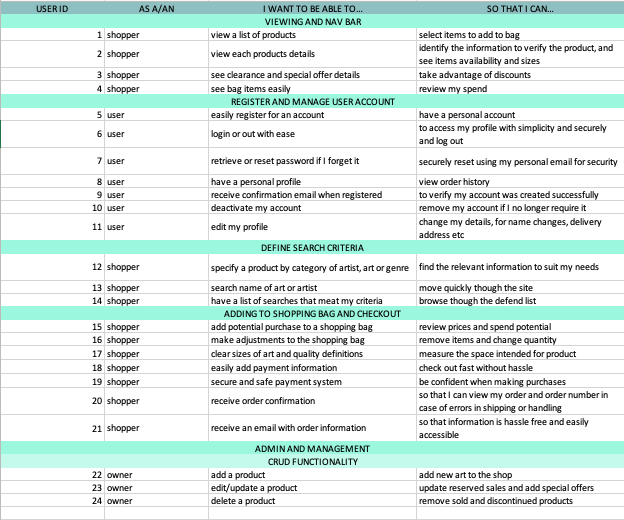

___
# Lakeside Art Prints

The Lakeside Art Prints web app enables users to shop and buy popular and to scale art prints. Bringing renowned and new artist home. 

Click [here]() to view the Lakeside Art Prints app.

___

# Contents

* [Project Summary](#project-summary)
* [UX Design](#ux-design)
    * [User Stories](#user-stories)
* [Strategy](#strategy)
    * [Project Goals](#project-goals)
* [Scope](#scope)
    * [Features](#features)
* [Structure](#structure)
    * [Initial Page Structure](#initial-page-structure)
* [Skelaton](#skeleton)
    * [Wireframes](#wireframes)
* [Surface](#surface)
* [Database](#database)
* [Website Operation](#website-operations)
* [Testing](#testing)
* [Deployment](#deployment)
    * [GitHub](#github)
    * [Heroku](#heroku)
* [Technologies Used](#technologies-used)
* [Credits](#credits)
* [Acknowledgements](#acknowledgements)

___

# Project Summary

This is my milestone 4 project for [Code Institute](https://codeinstitute.net/full-stack-software-development-diploma/?utm_term=code%20institute&utm_campaign=CI+-+UK+-+Search+-+Brand&utm_source=adwords&utm_medium=ppc&hsa_acc=8983321581&hsa_cam=1578649861&hsa_grp=62188641240&hsa_ad=581730217381&hsa_src=g&hsa_tgt=kwd-319867646331&hsa_kw=code%20institute&hsa_mt=e&hsa_net=adwords&hsa_ver=3&gclid=Cj0KCQjw39uYBhCLARIsAD_SzMQRkFHd37KmBJCgz0mnmWk7GFHBrSrpY-pEyY0CA0uE9XueVlxpykcaAjVnEALw_wcB)'s  Level 5 Diploma in Web Application Development (Full Stack Software Development)

The objective for this project was to create a full stack web app using [Django](https://www.djangoproject.com/) frameworks. The site will provide a user with the option to create a personal account, add products to a shopping bag with full crud capability and to make payments using [Stripe](https://stripe.com/gb).

___

# Ux design

## User Stories

The user Stories for the site development assess the app usability for a daily user, shoppers, and business owner perspectives.

___

# Strategy

## Project Goals

___
# Scope

## Features

___
# Structure

## Initial Page Structure

___
# Skelaton
## Wireframes

___
# Surface

___
# Database
___
# Website Operation
___
# Testing

___
# Deployment
___
# Technologies Used
___
# Credits
___
# Acknowledgements

