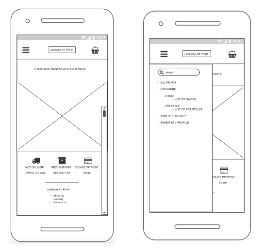
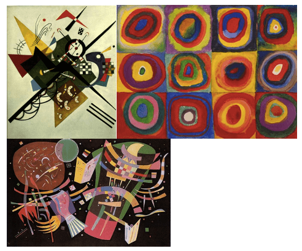
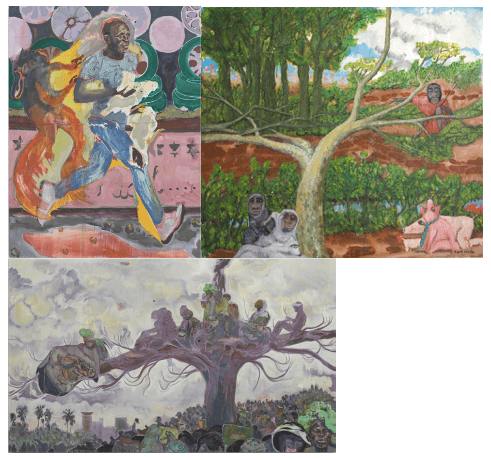
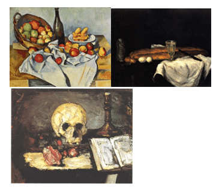

___
# Lakeside Art Prints

The Lakeside Art Prints web app enables users to shop and buy popular and to scale art prints. Bringing renowned and new artist home. 

Click [here]() to view the Lakeside Art Prints app.

___

# Contents

* [Project Summary](#project-summary)
* [UX Design](#ux-design)
    * [User Stories](#user-stories)
        * [Guest User](#guest-user)
        * [Registered User](#registered-user)
        * [Admin](#admin)
* [Strategy](#strategy)
    * [Project Goals](#project-goals)
    * [Business Goals](#business-goals)
    * [Value to Users](#value-to-users)
    * [Key Demographic](#key-demographic)
* [Scope](#scope)
    * [Features](#features)
    * [Functionality](#functionality)
* [Structure](#structure)
    * [Site Maps](#site-maps)
        * [Guest User Site Map](#guest-user-site-map)
        * [Registered User Site Map](#registered-user-site-map)
* [Skelaton](#skeleton)
    * [Wireframes](#wireframes)
        * [Home Page and Navigation Bar](#home-page-and-navigation-bar)
        * [Shopping Page and Individual Product Selection](#shopping-page-and-individual-product-selection)
        * [Basket and Checkout Page](#basket-and-checkout-page)
        * [Payment Authentication and Confirmation Page](#payment-authentication-and-confirmation-page)
        * [Registered User Profile Page](#registered-user-profile-page)
* [Surface](#surface)
    * [Images](#images)
        * [Home Page Images](#home-page-images)
        * [Product Images](#product-images)
    * [Dataset](#dataset)
        * [Artist Dataset](#artish-dataset)
        * [Art Dataset](#art-dataset)
* [Database](#database)
* [Website Operation](#website-operations)
* [Testing](#testing)
* [Deployment](#deployment)
    * [GitHub](#github)
    * [Heroku](#heroku)
* [Technologies](#technologies)
    * [Programming Languages](#programming-languages)
    * [Libraries](#libraries)
    * [Frameworks and Extentions](#frameworks-and-extentions)
    * [Database](Database)
    * [Hosting and IDE](#hosting-and-ide)
    * [Design and Development](#design-and-development)
    * [Validation and Testing](#validation-and-testing)
* [Credits](#credits)
* [Acknowledgements](#acknowledgements)

___

# Project Summary

This is my milestone 4 project for [Code Institute](https://codeinstitute.net/full-stack-software-development-diploma/?utm_term=code%20institute&utm_campaign=CI+-+UK+-+Search+-+Brand&utm_source=adwords&utm_medium=ppc&hsa_acc=8983321581&hsa_cam=1578649861&hsa_grp=62188641240&hsa_ad=581730217381&hsa_src=g&hsa_tgt=kwd-319867646331&hsa_kw=code%20institute&hsa_mt=e&hsa_net=adwords&hsa_ver=3&gclid=Cj0KCQjw39uYBhCLARIsAD_SzMQRkFHd37KmBJCgz0mnmWk7GFHBrSrpY-pEyY0CA0uE9XueVlxpykcaAjVnEALw_wcB)'s  Level 5 Diploma in Web Application Development (Full Stack Software Development)

The objective for this project was to create a full stack web app using [Django](https://www.djangoproject.com/) frameworks. The site will provide a user with the option to create a personal account, add products to a shopping bag with full crud capability and to make payments using [Stripe](https://stripe.com/gb).

[Back to top](#contents)
___

# Ux design

## User Stories

The user Stories for the site development assess the app usability for a daily user, shoppers, and business owner perspectives.

### Guest User

As casual/first time user – As a site user that has not created an account, I want to be able to:

- Find out more about Lakeside Art Prints and to navigate it
- Search for specific artist and art
- Find detailed information retaining to the art and artist
- Have a clear example of print sizes
- View estimated delivery and costs
- Add items to basket 
- Review and edit and delete basket items
- Make purchases as a guest user
- Create an account if I want to do more
- Contact Lakeside Art Prints to report, query, and rectify and problems

### Registered User

As a site user that has created an account, I want to be able to:

- Do all that a casual user can
- Easily register for an account
- Log in and out with ease
- Edit my profile and update details, change of address, name etc
- View my full purchase history
- Retrieve or reset forgotten passwords

### Admin 

As the shop admin, I want to be able to:

- Add products to the shop
- Edit/ update a product with special offers
- Delete a discontinued product

[Back to top](#contents)
___

# Strategy

From the user stories the following goals have been recognised for the project, business and user strategy.

## Project Goals
The aim for this project is to produce a web app for Lakeside Art Prints. Users will be able to register an account for or continue as a guest user. The site will enable all users to navigate the full art product. Add items to a basket, edit and delete basket items and make payments using stripe payment system. Registered users will have the additional advantage of easy payment process with auto complete forms and a full view of order history. 

## Business Goals
The business' admin account will be able to manage the product data. Adding updating/editing and deleting products. Recieve order details to keep up to date with purcharse.  

## Value to Users 
Users get a full product art and artist deptails. A size Guide to help with purchasing choices.
Registered users can keep track of purchases, manage a peronal profile, and make less hassle purchases. 

## Key Demographic
- Art enthusiast of all ages
- Interior designers 
- Customers making home improvements

[Back to top](#contents)
___
# Scope

## Features

The following list of objectives has been determined to designed and achieve a well-balanced website that meets the needs and requirements of the business and users strategy outcomes.  Within the designated time scale the following criteria will be introduced to the website on initial release. 

Importance rating 1-5 (5 being most important)

| Features   | Importance |
| :---------- | ---: |
| Details on art and artist | 2 |
| Search option to refine criteria |3 |
| Print size options | 4 |
| Delivery estimation and cost | 4 |
| Add, edit, and delete basket items | 5 |
| Make pruchases as a guest user | 5 |
| Register and sign in to a personal profile account | 5 |
| Log in and out of registered account | 5 |
| Edit and update profile details | 4 |
| View my full purchase history | 3 |
| Retrieve or reset forgotten passwords | 4 |
| Deactivate registered account | 3 |
| Contact details for the company | 3 |
| Add, Edit/update and delete products from admin account | 5 |

# Functionality

- Clear presentation of information and imagery across a fully responsive web application
- Easy navigation across all pages
- Fast load and response time
- Developer contact for updates and bug reports

[Back to top](#contents)
___
# Structure

## Site Maps

The topology diagrams indicate the site map design for a guest user and registered user.

### Guest User Site Map

This site map displays the designed moveability across the site for a guest user without a registered account. With the highlight importance emphasised in the scope plane.

### Registered User Site Map

This site map displays the designed moveability across the site for a registered account user. With the indication also from the scope plane the registered user has better access to order information and simpler billing as details will auto complete the account details.

[Back to top](#contents)
___
# Skelaton
## Wireframes

These wireframes are designed using the site maps and features highlighted above. The following is the skeleton layout for the Lakeside Art Prints web app.

### Home Page and Navigation Bar

#### The home page:
-	Description about Lakeside Art Prints. What the company offer and how it got started.
-	An opening image of artwork displayed in a home, products in use.
-	Icons with descriptions about delivery, shipping cost and payment.
-	Footer with information about the company, delivery, and returns, and how to make contact.
#### The Nav bar:
-	Search bar that enables users to refine a product list.
-	Categories with further lists of product views by artist or art style.
-	Sign in for registered users / replaced by a log out button when signed in.
-	Register button for guest users to create an account / replaced by a profile button for users to view their page when they are signed in.
-	The company Logo 
-	Shopping basket icon for selected purchase items

### Shopping Page and Individual Product Selection

#### Shopping Page:
-	A full scrolling list of art print images each with the name of the work, and the pricing starting from.
-	A category and filter search buttons.
-	Navbar and footer remaining
#### Product Selection:
-	An enlarge image of artwork clicked on
-	An art size selector where prices increase the larger the image.
-	Size guide for further measurement units
-	Add to basket button
-	Product description
    -  Name of Art, and its age and art style
	-  Name of Artist, dob, they nationality, type of artwork they specialised in.
-	Navbar and footer remaining

### Basket and Checkout Page

#### Basket:
-	Basket icon will increment with each item added to it.
-	On click of the basket a view window with a list of products by image, name, size selected, quantity, price + delivery = total cost.
-	Checkout button.
#### Checkout Page:
-	A list of products by image, name, size selected, quantity, price + delivery = total cost.
-	A delivery field for guest users to fill in that will auto fill for registered users.
-	Payment details field.
-	Make payment button.

### Payment Authentication and Confirmation Page

#### Payment Authentication:
-	Pop out window with Payment Authentication from stripe
#### Confirmation Page:
-	A title to confirm payment is complete
-	A message that a receipt has been forwarded to the customer’s email
-	A purchase order number.
-	A button to take customer back to the home page.

### Registered User Profile Page

#### Profile Account Page:
-	A back button to move from the profile page.
-	Links to:
    -	Current orders to view pending delivery items and descriptions.
    -	View all previous completed orders.
	-   Personal details.
        - Edit button to update information.
-	Deactivate account button.
-	Logout button.

[Back to top](#contents)
___
# Surface

The visual design for the website covers the colours, fonts, effects, and images.

## Colours

Web app colour design was selected to reflect an image chosen for the home page. The colour are simple, elegant and natural tones that will enable all art print images to stand out on screen.

colour selection from [Image Colour Picker](https://imagecolorpicker.com/en)

## Typography

The fonts and sizes where selected from [Google Fonts](https://fonts.google.com/).

- Cormorant Garamond
    
    Light 300

- Noto Serif Georgian
    
    ExtraLight 200
    
    Light 300

## Images

## Home page Images
These Images will carousel on the homepage. The wall mounted pictures are products available to purchase from Lakeside Art Prints.

These are [Unsplash images by Kam Idris](https://unsplash.com/@ka_idris) and adapted using [Pixlr](https://pixlr.com/)

## Product Images

The shop app will require visual imagery of each product. The artist and images of their works along with the direct source of the imagery is available in the dropdown selector below.

Product Images

#### Wassily Kandinsky Artwork. 
Images from [WikiArt](https://www.wikiart.org/)

#### Jackson Pollock Artwork. 
Images from [Jackson-Pollock.org](https://www.jackson-pollock.org/)

#### Bridget Riley Artwork.
Images from [WikiArt](https://www.wikiart.org/)

#### Norman Rockwell Artwork.
Images from [WikiArt](https://www.wikiart.org/)

#### Vicente Romero Redondo Artwork.
Images from [Forest Gallery](https://www.forestgallery.com/)

#### Michael Armitage Artwork.
Images from [Royal Academy](https://www.royalacademy.org.uk/)

#### Kazimir Malevich Artwork
Images from [Jon Blackwood](https://jonblackwood.net/)

#### Sean Scully Artwork.
Images from [WikiArt](https://www.wikiart.org/)

#### Edna Andrade Artwork.
Images from [WikiArt](https://www.wikiart.org/)

#### Pablo Picasso Artwork.
Images from [Pablio-Picasso.net](https://www.pablopicasso.net/)

#### Agnes Martin Artwork.
Images from [WikiArt](https://www.wikiart.org/)

#### Jiro Yoshihara Artwork. 
Images from [WikiArt](https://www.wikiart.org/)

#### Vincent Van Gogh Artwork.
Images from [WikiArt](https://www.wikiart.org/)

#### Nives Palmic Artwork.
Images from [Fine Art America](https://fineartamerica.com/)

#### Claude Monet Artwork.
Images from [WikiArt](https://www.wikiart.org/)

#### Andy Warhol Artwork.
Images from [MFA](https://www.masterworksfineart.com/)

#### Roy Lichtenstein Artwork.
Images from [WikiArt](https://www.wikiart.org/)

#### Julian Opie Artwork.
Images from [WikiArt](https://www.wikiart.org/)

#### Frida Kahlo Artwork.
Images from [FridaKohle.org](https://www.fridakahlo.org/frida-kahlo-paintings.jsp)

#### Kehinda Wiley Artwork.
Images from [Stephen Friedman Gallery](https://www.stephenfriedman.com/)

#### Elizabeth Peyton Artwork.
Images from [Thaddaeus Ropac](https://ropac.net/)

#### Hilary Pecis Artwork.
Images from [Thaddaeus Ropac](https://www.hilarypecis.com/)

#### Paul Cezanne Artwork.
Images from [WikiArt](https://www.wikiart.org/)

#### Sharon Core Artwork.
Images from [Yancey Richards](https://www.yanceyrichardson.com/)

#### Salvador Dali Artwork.
Images from [Dali Paintings](https://www.dalipaintings.com/)

#### Remedio Varo Artwork.
Images from [WikiArt](https://www.wikiart.org/)

#### Zdzislaw Beksinski Artwork.
Images from [WikiArt](https://www.wikiart.org/)

#### Christopher Wool Artwork.
Images from [Luhring Augustine](https://www.luhringaugustine.com/)

#### Craig Ward Artwork.
Images from [Words are Pictures](http://wordsarepictures.co.uk/)

#### Deniz Akerman Artwork.
Images from [IN PRNT](https://www.inprnt.com/)

#### Banksy Artwork.
Images from [WikiArt](https://www.wikiart.org/)

#### Jbesset Artwork.
Images from [Artsper](https://www.artsper.com/gb/contemporary-artists/france/4171/jbesset)

#### Mariana PTKS Artwork.
Images from [Compulsive Content](https://www.compulsivecontents.com/)

 

## Dataset

The information gathered for the datasets comes from [Wikipedia](https://en.wikipedia.org/wiki/Main_Page) and [WikiArt](https://www.wikiart.org/) and list of galleries and artist websites that are listed with the products images.

### Artist Dataset

Click for the artist dataset

 

### Art Dataset

Click for the art dataset

 

[Back to top](#contents)
___
# Database

[Back to top](#contents)
___
# Website Operation

[Back to top](#contents)
___
# Testing

[Back to top](#contents)
___
# Deployment

## Github

## Heroku

[Back to top](#contents)
___
# Technologies Used
The followng technologies were used for the web app development

## Programming Languages

- [HTML](https://en.wikipedia.org/wiki/HTML)
        
    is the standard markup language for documents designed to be displayed in a web browser.
- [CSS](https://en.wikipedia.org/wiki/CSS)
    
    is a style sheet language used for describing the presentation of a document written in a markup language such as HTML 
- [JavaScript](https://en.wikipedia.org/wiki/JavaScript)
    
    is a programming language that is one of the core technologies of the World Wide Web, alongside HTML and CSS.
- [Python](https://en.wikipedia.org/wiki/Python_(programming_language))
    
    is a high-level, general-purpose programming language.

## Libraries

- [Font Awesome](https://en.wikipedia.org/wiki/Font_Awesome)
    
    is a font and icon toolkit based on CSS and Less.
- [jQuery](https://en.wikipedia.org/wiki/JQuery)
    
    is a JavaScript library designed to simplify HTML DOM tree traversal and manipulation, as well as event handling, CSS animation, and Ajax.

- [Google Fonts](https://en.wikipedia.org/wiki/Google_Fonts)

    is a computer font and web font service owned by Google.

## Frameworks and Extentions

- [Django](https://en.wikipedia.org/wiki/Django_(web_framework))
    
    is a free and open-source, Python-based web framework that follows the model–template–views (MTV) architectural pattern.
- [Bootstrap](https://en.wikipedia.org/wiki/Bootstrap_(front-end_framework))
    
    is a free and open-source CSS framework directed at responsive, mobile-first front-end web development.
- [Stripe](https://en.wikipedia.org/wiki/Stripe,_Inc.)

    provides APIs that web developers can use to integrate payment processing into their websites and mobile applications.

## Database

- [Heroku Postgres](https://en.wikipedia.org/wiki/Heroku)
    
    is the Cloud database (DBaaS) service for Heroku based on PostgreSQL.

## Hosting and IDE

- [Github](https://en.wikipedia.org/wiki/GitHub)

    is an Internet hosting service for software development and version control using Git.
- [Gitpod](https://en.wikipedia.org/wiki/Eclipse_Theia)
    
    is a free and open-source framework for building IDEs and tools based on modern web technologies.

- [Heroku](https://en.wikipedia.org/wiki/Heroku)

    is a cloud platform as a service (PaaS) supporting several programming languages.

## Design and Development

- [Chrome DevTools](https://en.wikipedia.org/wiki/Web_development_tools)
    
    allow web developers to test and debug their code. 

- [tinyPNG](https://tinypng.com/) 

    Used within development process to compress image file size.

- [Balsamiq Wireframes](https://balsamiq.com/)

    A design software used for creating wireframes. 

- [Pixlr](https://pixlr.com/)

    An image source and editing tool

## Validation and Testing

- [W3 validator](https://en.wikipedia.org/wiki/W3C_Markup_Validation_Service)

    is a validator by the World Wide Web Consortium (W3C) that allows Internet users to check pre-HTML5 HTML and XHTML documents for well-formed markup against a document type definition.

- [W3 Jigsaw](https://www.w3.org/wiki/CssValidator)
    
    is a CSS validator and free software developed by W3C, and a free online service .

- [JS Hint](https://en.wikipedia.org/wiki/JSHint)

     is a static code analysis tool used in software development for checking if JavaScript source code complies with coding rules.

- [PEP8](http://pep8online.com/)

    is a python validating tool used in software development.

[Back to top](#contents)
___
# Credits

- The information gathered for the datasets comes from [Wikipedia](https://en.wikipedia.org/wiki/Main_Page) and [WikiArt](https://www.wikiart.org/) and list of galleries and artist websites that are listed with the products images.
- Videos and teachings from [code institute](https://codeinstitute.net/) 
- Tuition, guidence, and project guidelines from [Harlow College](https://www.harlow-college.ac.uk/)

For development design support the following websites were used for research

- [Desenio](https://desenio.co.uk/) 
- [King and McGaw](https://www.kingandmcgaw.com/)

[Back to top](#contents)
___
# Acknowledgements

[Back to top](#contents)

