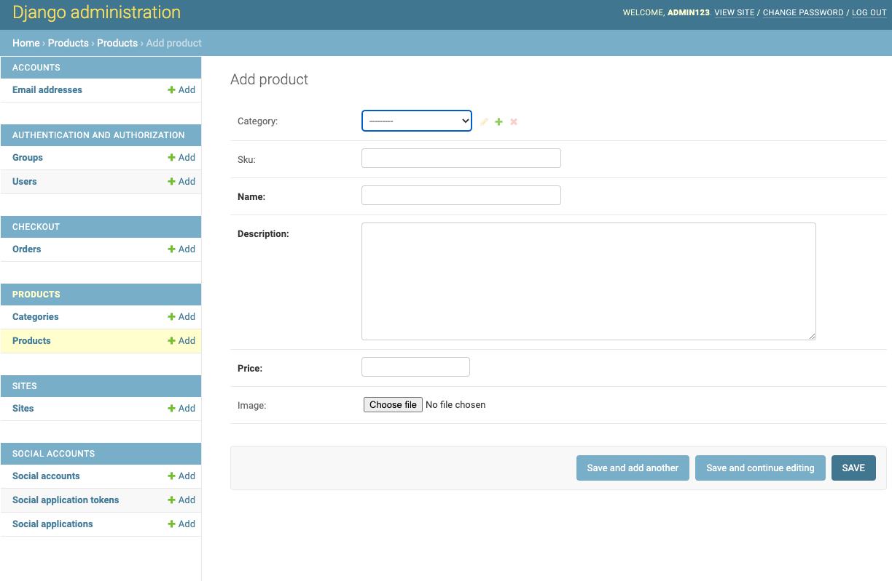
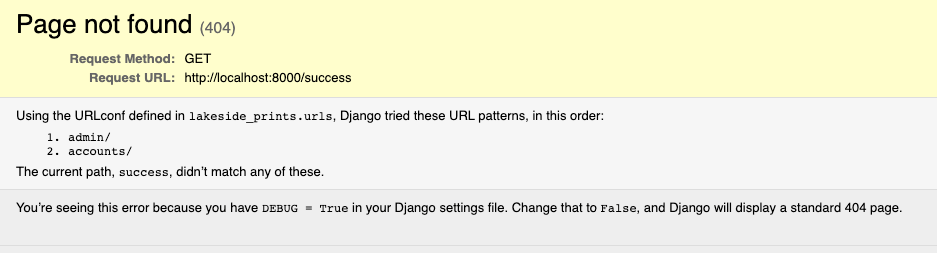

# Testing

# Contents

* [MANUAL TESTING](#manual-testing)
    * [User Stories](#user-stories)
        * [Guest User](#guest-user)
        * [Registered User](#registered-user)
        * [Admin](#admin)
    * [Responsive](#responsive)
    * [Browsers](#browsers)
* [AUTOMATED TESTING](#automated-testing)
    * [Lighthouse](#lighthouse)
    * [W3C Validator](#w3c-validator)
    * [W3 Jigsaw](#w3-jigsaw)
    * [JS Hint](#js-hint)
    * [PEP8](#pep8)
* [Bugs](#bugs)
    * [Allauth](#allauth)
* [Furture Updates](#future-updates)
___
# MANUAL TESTING
Manual testing is when project designers and developers to inspect software for defects. It requires the devloper to play the role of an end user where by they use most of the application's features to ensure correct behaviour.

[Back to top](#contents)

___
# User Stories

To test user stories a screen shot and brief description is provided as evidence that the criteria has been met.

## Guest User

As casual/first time user – As a site user that has not created an account, I want to be able to:

| Find out more about Lakeside Art Prints and to navigate it. |
|----| 
| To find out information about the site its delivery and returns and contact information, this can be found in collapsible buttons in the footer.|

| Search for specific artist and art |
|----|
|The search option in the navbar will render data linked to the searched criteria. By art name, artist name, price, art style and date.|

|Using the drop down tab the data display can be refind by art styles and all products.|

| Find detailed information retaining to the art and artist |
|----|
| When clicking on the selected product the details on the art name, style, artist and date of art work are displayed. |

| View estimated delivery and costs |
|----|
| Delivery costs are calculated in the shoppping bad. A total cost is visible on under the basket icon in the navbar. The free delivery threshold is also calculated for user to see how much more they could spend to achieve free delivery. | 

| Add items to basket |
|----|
| When an item is selected the user continue to add the product to the bag by clicking the add to bag button |

| Review and edit and delete basket items |
|----|
| The update button enables the user to change the quantity of item. Doing so would also update the cost and delivery implications. The remove button can delete the product from the bag. If it was the only product in the bag the user will be directed to the empty bag page. |

| Make purchases as a guest user |
|----|
| Guest users can make purchaces and confirmation page will display the full order, cost and delivery address details. Also a confirmation email detail will display above the form. |

| Create an account if I want to do more |
|----|
| An account can be created via the my account drop down in the navbar. Alternativly a registration link is provided before checkout. |

| Contact Lakeside Art Prints to report, query, and rectify and problems |
|----|
| Contact details are avalible in collapsible button in the footer |

[Back to top](#contents)

## Registered User

As a site user that has created an account, I want to be able to:

| Do all that a casual user can |
|----|
| All requirements are met in the user stories |

| Easily register for an account |
|----|
| An account can be created via the my account drop down in the navbar. Alternativly a registration link is provided before checkout. |

| Log in and out with ease |
|----|
| A simple sign in form, once completed, will direct the user to their profile page. Using the link in the navbar the user can re-view thier page and log out |

| Edit my profile and update details, change of address, name etc |
|----|
| The user can update their contact number and delivery details. Also when the user makes payment the delivery details will auto fill with their profile details |

| View my full purchase history |
|----|
| When the account user makes a purchace the order details will be logged on the profile page order history. Additionally clicking on the order number will display the full order details.

| Retrieve or reset forgotten passwords |
|----|
| Given the project time scale this has been marked as an immediate update |

[Back to top](#contents)

## Admin 

As the shop admin, I want to be able to:

| Add products to the shop |
|----|
| Simply select products and add product. From there fill in the required fields and save. The product details will be added to the product list.|

| Edit/ update a product & Delete a discontinued product |
|----|
| Selecting an individual project and the field can be altered and saved. The detete button will also remove the product completely. |

[Back to top](#contents)

___
# Responsive

The sites responsive design was tested using Google Crome and firefox devTools

|| Small Mobile | Med Mobile | Tablet | Laptop | Large Laptop | Desktop |
| --- | --- | --- | --- | --- | --- | --- | 
| site | Pass |Pass | Pass | Pass | Pass | Pass |
| images | Pass |Pass |Pass |Pass |Pass |Pass |

[Back to top](#contents)
___
# Browsers

- [Google Chrome](https://en.wikipedia.org/wiki/Google_Chrome) *'is a cross-platform web browser developed by Google.'*
- [Microsoft Edge](https://en.wikipedia.org/wiki/Microsoft_Edge) *'is a cross-platform web browser created and developed by Microsoft.'*
- [Safari](https://en.wikipedia.org/wiki/Safari_(web_browser)) *'is a graphical web browser developed by Apple.'*
- [Mozilla Firefox](https://en.wikipedia.org/wiki/Firefox) *'is a free and open-source web browser developed by the Mozilla Foundation and its subsidiary, the Mozilla Corporation.'*

[Back to top](#contents)

___
# AUTOMATED TESTING

Automated testing is the use of a software separate from the software being tested to control the execution of tests and the comparison of actual outcomes with predicted outcomes.

[Back to top](#contents)

___
# Lighthouse
*'An open-source, automated tool for measuring the quality of web pages.'* - [Wikipedia Google Lighthouse](https://en.wikipedia.org/wiki/Google_Lighthouse)

[Back to top](#contents)

___
# W3 validator
*'is a validator by the World Wide Web Consortium (W3C) that allows Internet users to check pre-HTML5 HTML and XHTML documents for well-formed markup against a document type definition.'* - [ Wikipedia W3 validator](https://en.wikipedia.org/wiki/W3C_Markup_Validation_Service)

Testing html was used in fragments as python code displayed errors. With these pieces of codes ignored the code past validation.

[Back to top](#contents)

___
# W3 Jigsaw
*'is a CSS validator and free software developed by W3C, and a free online service.'* - [W3 Jigsaw](https://www.w3.org/wiki/CssValidator)

Css testing displayed a single error stating an anchor in a comment didnt have a closing tag. With the closing tag added, the code past validation.

[Back to top](#contents)

___
# JS Hint
*'is a static code analysis tool used in software development for checking if JavaScript source code complies with coding rules.'* - [Wikipedia JS Hint](https://en.wikipedia.org/wiki/JSHint)

With two minor warnings the code passed validation.

[Back to top](#contents)

___
# PEP8
*'is a python validating tool used in software development.'* - [PEP8](http://pep8online.com/)

 [Back to top](#contents)   

___
# Bugs

| Test number | Description | Expectation | Outcome | Pass/Fail | Comments |
| --- | --- | --- | --- | --- | --- |
| 1 | css mobile nav miss-aligned | expected inline links | links stack forcing the navbar to extend down the page | Fail | test 1 |
| 2 | css mobile nav miss-aligned | expected inline links | reduced padding at mobile query | pass | test 1-review |
| 3 | admin login | login to admin account | login failed error | fail | test 2 |
| 4 | admin login | login to admin account | temporary commented out signal, logged into admin via html login page, reactivated signal | pass | test 2- review|

## Allauth
Authentication using django allauth

Testing that allauth has been setup correctly.

manually creating a user email address via admin and enabling authentication.

The error messsage shows that the redirct (success) has worked and that authentication is running correctly.

[Back to top](#contents)

## Payment testing
Strip payment testing. To ensure that strip payment was set up and that payment was received to strip payment system.

___
# Future Updates

- Create a superuser for admin to add, update and remove products via the page login.

- Add delete function for the registered users to delete their user account.

[Back to top](#contents)
